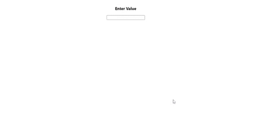

# ReactJS - Currency Input

Currency Input component built in ReactJS, used for currency value input field for all countries. You can change prefix and suffix for input. Can also handle negative and positive values depending on requirement.

## Table of contents

- [Browser Support](#browser-support)
- [Demo](#demo)
- [Features](#features)
- [Getting started](#getting-started)
- [Usage](#usage)
- [Examples](#Examples)
- [Available Props](#available-props)
- [Want to Contribute?](#want-to-contribute)
- [Collection of Other Components](#collection-of-components)
- [Changelog](#changelog)
- [Credits](#credits)
- [License](#license)
- [Keywords](#Keywords)

## Browser Support

 |  |  |  |  |
--- | --- | --- | --- | --- | --- |
83.0 ✔ | 77.0  ✔ | 13.1.1 ✔ | 83.0 ✔ | 11.9 ✔ |

## Demo

[](https://github.com/weblineindia/ReactJS-Currency-Input/currency-input.gif)

## Features

* Prefix, suffix and thousand separator.
* Custom format pattern.
* Masking.  
* Custom formatting handler.
* Formatting a input or a simple text.


## Getting started

Install the npm package:

``` bash
npm install react-weblineindia-currency-input 
# OR 
yarn add react-weblineindia-currency-input
```

## Usage

ES6
```js
import CurrencyFormat from 'react-weblineindia-currency-input';
```

ES5
```js
const CurrencyFormat = require('react-weblineindia-currency-input');
```

Typescript
```js
import * as CurrencyFormat from 'react-weblineindia-currency-input';
```

```js
import React, { Component } from "react";
import CurrencyFormat from 'react-weblineindia-currency-input';

class Test extends Component {
  constructor(props) {
    super(props);
    this.state = {
    }
  }
  render(){
      return(
          <div>
          <CurrencyFormat value={2456981} displayType={'text'} thousandSeparator={true} prefix={'$'} />
           </div>
      )
  }
}
export default Test

```


### Examples

#### Prefix and thousand separator : Format currency as text
```jsx
var CurrencyFormat = require('react-currency-format');

<CurrencyFormat value={2456981} displayType={'text'} thousandSeparator={true} prefix={'$'} />
```
Output : $2,456,981

#### Custom renderText method
```jsx
var CurrencyFormat = require('react-currency-format');

<CurrencyFormat value={2456981} displayType={'text'} thousandSeparator={true} prefix={'$'} renderText={value => <div>{value}</div>} />
```
Output : `<div> $2,456,981 </div>`

#### Format with pattern : Format credit card as text
```jsx
<CurrencyFormat value={4111111111111111} displayType={'text'} format="#### #### #### ####" />
```
Output : 4111 1111 1111 1111

#### Prefix and thousand separator : Format currency in input
```jsx
<CurrencyFormat thousandSeparator={true} prefix={'$'} />
```
## Available Props
| Props        | Options           | Default  | Description |
| ------------- |-------------| -----| -------- |
| thousandSeparator | mixed: single character string or boolean true (true is default to ,) |none| Add thousand separators on number |
| thousandSpacing | String, One of ['2', '2s', '3', '4'] | '3' | Add thousand group spacing on number. Default: '2' will format like 1,23,45,67,89 __ '3' will format like 1,234,567,981 __ '2s' will format like 1,23,45,67,981 __ '4' will format like 1,2345,6789 |
| decimalSeparator | single character string| . | Support decimal point on a number |
| decimalScale | number| none| If defined it limits to given decimal scale |
| fixedDecimalScale | boolean| false| If true it add 0s to match given decimalScale|
| allowNegative      | boolean     |   true | allow negative numbers (Only when format option is not provided) |
| prefix      | String (ex : $)     |   none | Add a prefix before the number |
| suffix | String (ex : /-)      |    none | Add a prefix after the number |
| value | Number or String | null | Value to the number format. It can be a float number, or formatted string. If value is string representation of number (unformatted), isNumericString props should be passed as true. |
| isNumericString | boolean | false | If value is passed as string representation of numbers (unformatted) then this should be passed as true |
| displayType | String: text / input | input | If input it renders a input element where formatting happens as you input characters. If text it renders it as a normal text in a span formatting the given value |
| type | One of ['text', 'tel'] | text | Input type attribute |
| format | String : Hash based ex (#### #### #### ####) <br/> Or Function| none | If format given as hash string allow number input inplace of hash. If format given as function, component calls the function with unformatted number and expects formatted number. |
| removeFormatting | (formattedValue) => numericString | none | If you are providing custom format method and it add numbers as format you will need to add custom removeFormatting logic |
| mask | String (ex : _) | none | If mask defined, component will show non entered placed with masked value. |
| customInput | Component Reference | input | This allow supporting custom inputs with number format. |
| onValueChange | (values) => {} | none | onValueChange handler accepts [values object](#values-object) |
| isAllowed | ([values](#values-object)) => true or false | none | A checker function to check if input value is valid or not |
| renderText | (formattedValue) => React Element | null | A renderText method useful if you want to render formattedValue in different element other than span. |
-----


## Want to Contribute?

- Created something awesome, made this code better, added some functionality, or whatever (this is the hardest part).
- [Fork it](http://help.github.com/forking/).
- Create new branch to contribute your changes.
- Commit all your changes to your branch.
- Submit a [pull request](http://help.github.com/pull-requests/).

-----

## Collection of Components

We have built many other components and free resources for software development in various programming languages. Kindly click here to view our [Free Resources for Software Development](https://www.weblineindia.com/software-development-resources.html).

------

## Changelog

Detailed changes for each release are documented in [CHANGELOG.md](./CHANGELOG.md).

## Credits

react-weblineindia-currency-input is inspired by the [react-currency-format](https://www.npmjs.com/package/react-currency-format).

## License

[MIT](LICENSE)

[mit]: https://github.com/weblineindia/ReactJS-Currency-Input/blob/master/LICENSE

## Keywords

react-weblineindia-currency-input, react-currency-input, react-currency-component, currency-input, money-input, currency-input-field, input-formatter, input-field-component